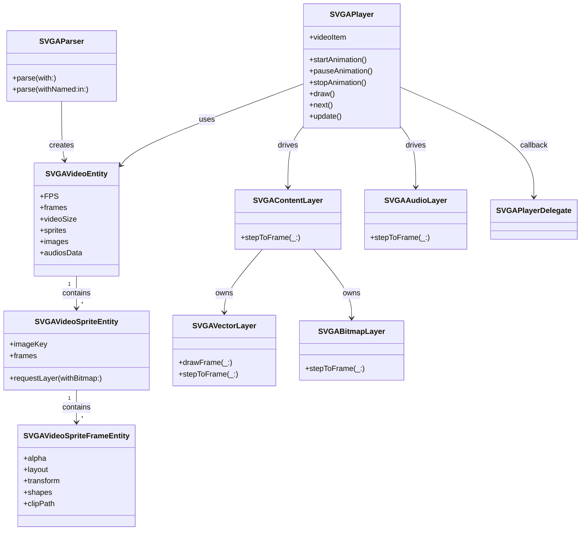
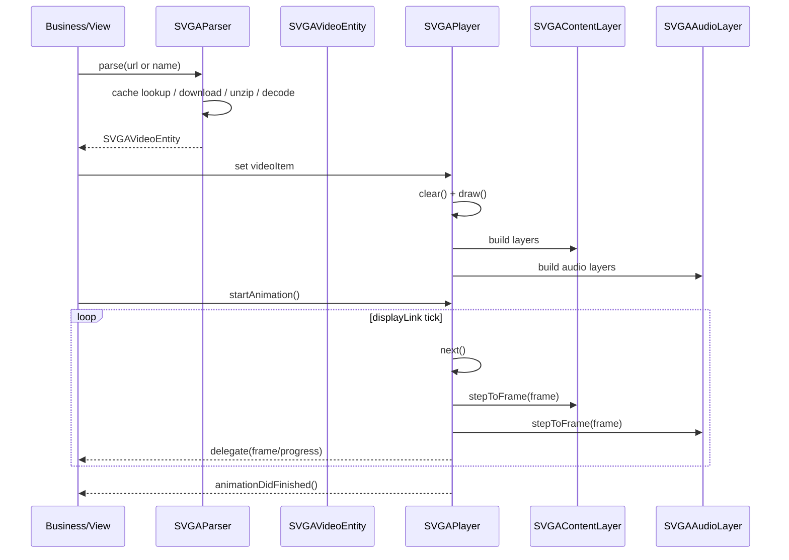

# SVGAPlayer 实现架构说明

本文档基于当前仓库 `BaseModules/SVGAPlayer` 的实际代码实现整理，重点描述模块分层、关键对象关系、播放链路、依赖与性能实现要点，并给出维护风险和改进建议。

## 1. 模块分层与职责

`SVGAPlayer` 当前可抽象为五层：

1. 解析与缓存层
2. 动画数据模型层
3. 渲染图层层（CoreAnimation）
4. 播放控制层
5. 音频与协议/导出层

### 1.1 解析与缓存层

- 关键文件：`SVGAParser.swift`
- 核心职责：
  - 支持远程 URL 与本地资源名解析（`parse(with:)` / `parse(withNamed:in:)`）
  - 自动识别 `zip` 与 `proto(binary)` 格式
  - 管理磁盘缓存目录（`Caches/svga/<md5>`）
  - 维护并发去重回调，避免同资源重复下载解析
  - 输出 `SVGAVideoEntity`

### 1.2 动画数据模型层

- 关键文件：
  - `SVGAVideoEntity.swift`
  - `SVGAVideoSpriteEntity.swift`
  - `SVGAVideoSpriteFrameEntity.swift`
  - `SVGAAudioEntity.swift`
- 核心职责：
  - 承载动画元数据（画布尺寸、FPS、总帧数）
  - 承载 sprite/frame/shape/音频时间轴
  - 保存解析后的图片与音频二进制
  - 维护 `SVGAVideoEntity` 级别内存缓存（`NSCache`）

### 1.3 渲染图层层（CoreAnimation）

- 关键文件：
  - `SVGAContentLayer.swift`
  - `SVGAVectorLayer.swift`
  - `SVGABitmapLayer.swift`
  - `SVGABezierPath.swift`
- 核心职责：
  - 将 sprite 转成可逐帧刷新的图层结构
  - 在每帧内应用 transform / alpha / shape path / mask / text 等更新
  - 矢量路径命令转 `UIBezierPath` 并落地到 `CAShapeLayer`

### 1.4 播放控制层

- 关键文件：
  - `SVGAPlayer.swift`
  - `SVGAImageView.swift`
- 核心职责：
  - 通过 `CADisplayLink` 驱动逐帧播放
  - 支持循环、区间播放、正反向、fillMode、播放完成回调
  - 支持动态替换图片/文本/隐藏层等能力

### 1.5 音频与协议/导出层

- 关键文件：
  - `SVGAAudioLayer.swift`
  - `pbobjc/Svga.pbobjc.h`
  - `pbobjc/Svga.pbobjc.m`
  - `SVGAExporter.swift`
- 核心职责：
  - 音频按帧调度播放（`AVAudioPlayer`）
  - pbobjc 提供 protobuf 数据结构解析基础
  - 导出能力支持逐帧输出图片

---

## 2. 关键对象关系

### 2.1 对象关系说明

- `SVGAParser` 负责解析资源并创建 `SVGAVideoEntity`
- `SVGAVideoEntity` 持有 sprites、frames、images、audiosData
- `SVGAPlayer` 持有 `videoItem: SVGAVideoEntity`
- `SVGAPlayer.draw()` 基于 sprites 生成 `SVGAContentLayer[]`
- `SVGAPlayer` 还会构建 `SVGAAudioLayer[]` 管理音频轨
- `SVGAContentLayer` 在每一帧执行 `stepToFrame(_:)` 更新内部子层
- `SVGAPlayerDelegate` 输出帧进度、百分比与播放结束事件

### 2.2 类关系图（Mermaid）

---

## 3. 播放链路（资源加载到渲染）

### 3.1 入口阶段

- 业务入口通常有两类：
  - 直接调用 `SVGAParser.parse(...)`
  - 通过 `SVGAImageView` 设置资源并自动加载播放

### 3.2 解析阶段

1. 优先命中内存缓存
2. 未命中则查磁盘缓存
3. 仍未命中则下载资源
4. 判断数据类型（zip/proto）
5. 解包/解压后解析 protobuf
6. 构建 `SVGAVideoEntity` 与内部 sprite/frame/audio 数据

### 3.3 组装图层阶段

- `SVGAPlayer.videoItem` 赋值后触发 `clear()` + `draw()`
- `draw()` 遍历 sprites，创建对应 `SVGAContentLayer`
- 处理内容包括：
  - bitmap 绑定（支持动态替换）
  - vector shape 构建
  - matte/mask 关系构建
  - 动态文本注入
  - 音频层初始化

### 3.4 逐帧驱动阶段

- `startAnimation()` 创建 `CADisplayLink`
- 每次 tick 执行：
  - `next()`：推进/回退帧号（正向或反向）
  - `update()`：刷新所有内容层与音频层
- 在循环计数满足后按配置结束，触发回调并执行 fillMode 收尾策略

### 3.5 播放时序图（Mermaid）

---

## 4. 外部依赖与上层集成

### 4.1 模块外部依赖（库自身）

- `SSZipArchive`：zip 解压
- `zlib`：压缩数据 inflate
- `CommonCrypto`：MD5（缓存 key）
- `Protobuf`：pbobjc 模型解码
- `AVFoundation`：音频播放
- `UIKit/QuartzCore/Foundation`：渲染与基础设施

依赖定义位于：`SVGAPlayerSwift.podspec`

### 4.2 仓库内典型集成点

- `BaseModules/PCShared/PCShared/Sources/Base/BubbleView/PCSvgaBubblePlayer.swift`
  - 对 `SVGAContentLayer` 做业务定制（如气泡背景适配）
- `BaseModules/PCCore/PCCore/Sources/Animation/PCSvgaAnimationPlayer.swift`
  - 封装统一动画播放协议
- `FeatureModules/PCVoxing/Sources/Main/PublicChat/View/Cells/PCVoxingMessageEmojiCell.swift`
  - 聊天消息场景触发表情动画播放

---

## 5. 线程、性能与缓存策略

### 5.1 线程模型

- 解析走后台队列（解析队列与解压队列）
- UI 渲染与图层更新在主线程（`CADisplayLink`）
- 回调主要回到主线程，便于业务层直接更新界面

### 5.2 缓存策略

- 内存缓存：`SVGAVideoEntity` 级别 `NSCache`
- 磁盘缓存：`Caches/svga/<md5>` 持久化动画资源与中间文件
- 并发去重：同一资源 key 合并请求，减少重复网络与解析消耗

### 5.3 性能要点

- `update()` 中通过 `CATransaction.setDisableActions(true)` 降低隐式动画开销
- `SVGAVectorLayer` 在 keep 帧场景可减少重复构建成本
- 大型复杂矢量动画时，非 keep 帧重建子层可能成为 CPU 热点

---

## 6. 维护风险与改进建议

### 6.1 已观察风险

1. `SVGABitmapLayer` 帧逻辑尚不完整（存在 TODO）
2. `SVGABezierPath` 对部分 path 指令支持不完整，可能静默降级
3. `SVGAParser` 职责偏重（下载、缓存、解码、回调聚合耦合）
4. `SVGAPlayer` 功能集中，类复杂度随需求增长风险较高
5. 缓存释放策略偏手动，可观测性不足

### 6.2 建议优化顺序（低风险优先）

1. 补齐并明确 `SVGABitmapLayer` 的帧更新语义
2. 给 `SVGABezierPath` 未支持指令增加显式日志/断言策略
3. 为 `SVGAParser` 拆分服务层（下载/缓存/解码），保留编排入口
4. 为缓存策略增加容量限制与命中率监控
5. 对 `SVGAPlayer` 拆分 timeline、layer builder、audio scheduler 子职责

---

## 7. 关键文件清单

- `BaseModules/SVGAPlayer/SVGAParser.swift`
- `BaseModules/SVGAPlayer/SVGAVideoEntity.swift`
- `BaseModules/SVGAPlayer/SVGAVideoSpriteEntity.swift`
- `BaseModules/SVGAPlayer/SVGAVideoSpriteFrameEntity.swift`
- `BaseModules/SVGAPlayer/SVGAPlayer.swift`
- `BaseModules/SVGAPlayer/SVGAImageView.swift`
- `BaseModules/SVGAPlayer/SVGAContentLayer.swift`
- `BaseModules/SVGAPlayer/SVGAVectorLayer.swift`
- `BaseModules/SVGAPlayer/SVGABitmapLayer.swift`
- `BaseModules/SVGAPlayer/SVGABezierPath.swift`
- `BaseModules/SVGAPlayer/SVGAAudioLayer.swift`
- `BaseModules/SVGAPlayer/pbobjc/Svga.pbobjc.h`
- `BaseModules/SVGAPlayer/pbobjc/Svga.pbobjc.m`
- `BaseModules/SVGAPlayer/SVGAExporter.swift`
- `BaseModules/SVGAPlayer/SVGAPlayerSwift.podspec`

